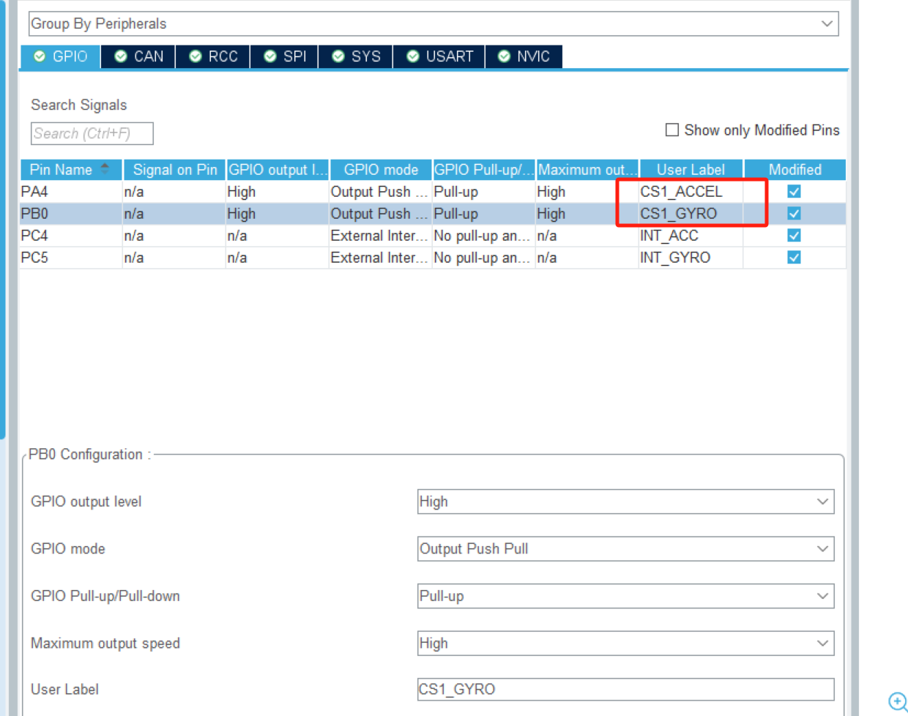

# 什么是SPI 以及 软件模拟SPI要怎么写
https://blog.csdn.net/wwt18811707971/article/details/77496938
# 什么是SPI的CS片选信号，以及如何配置。
需要用一根片选 CS 去控制两个或两个以上的 SPI 从设备时，需要在cubemx里面设置对应的GPIO。

https://blog.csdn.net/wwt18811707971/article/details/89190625#:~:text=CS:SPI%E4%BB%8E%E8%AE%BE%E5%A4%87%E6%98%AF